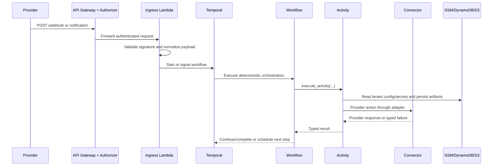

# Secamo Architecture Reference

## System Layers

Secamo follows a strict five-layer architecture that separates transport concerns, orchestration logic, side effects, and infrastructure dependencies.

- L1 (`API Gateway + Lambda Authorizer`) authenticates tenant context and enforces ingress gatekeeping.
- L2 (`Lambda Ingress Proxy`) validates provider payloads, normalizes request shapes, and starts or signals workflows.
- L3 (`Temporal Workflows`) contains deterministic orchestration logic and no direct I/O.
- L4 (`Activities + Connectors`) performs API/database/storage side effects and provider-specific adapter calls.
- L5 (`AWS services + Provider APIs`) hosts data stores/secrets and third-party security/ticketing endpoints.

Boundary rules:

- Workflows must not call AWS or provider APIs directly.
- Activities must be retry-safe and idempotent where possible.
- Tenant secrets are resolved from SSM path conventions, not hardcoded.

## Contract Ownership (Source of Truth)

Secamo enforces a single-source contract model split:

- `shared.models` owns domain contracts: workflow inputs/outputs, event payloads, and canonical business data models.
- `shared.providers` owns provider contracts: provider capability protocols, provider type enums, connector interface contracts, and provider-to-secret mapping.
- `connectors` owns concrete connector implementations only.

Rules:

- Do not define provider protocols in `shared.models`.
- Do not define domain/event payload models in `shared.providers`.
- Do not recreate a parallel `contracts/` package.

## Data Flow

The following sequence shows a representative flow from inbound event to orchestration and external side effects.

Operational flow characteristics:

- Ingress provides tenant-aware dispatch and callback signaling.
- Workflows coordinate branches and child workflows using durable Temporal history.
- Activities enforce side-effect boundaries and error translation for retries.

## Workflow Catalogue

| Workflow                                       | File                                                         | Trigger Source                                                                                  | Core Actions                                                                                         | Queue            | Status |
| ---------------------------------------------- | ------------------------------------------------------------ | ----------------------------------------------------------------------------------------------- | ---------------------------------------------------------------------------------------------------- | ---------------- | ------ |
| `CaseIntakeWorkflow`                           | `workflows/case_intake.py`                                   | Routed SOC intents (`defender.alert`, `defender.impossible_travel`, `defender.security_signal`) | Unified SOC intake, threat-intel/enrichment/ticket/HiTL/incident-response orchestration              | `edr`            | Active |
| `CustomerOnboardingWorkflow`                   | `workflows/customer_onboarding.py`                           | `customer.onboarding` event                                                                     | Stage-based onboarding orchestration (bootstrap, subscription reconcile, communications, compliance) | `user-lifecycle` | Active |
| `IamOnboardingWorkflow`                        | `workflows/iam_onboarding.py`                                | IAM lifecycle ingress events                                                                    | User create/update/delete/password reset with optional HiTL-gated license assignment and audit log   | `user-lifecycle` | Active |
| `DefenderAlertEnrichmentWorkflow`              | `workflows/defender_alert_enrichment.py`                     | Direct workflow trigger for `defender.alert`                                                    | Threat-intel branch, alert enrichment, optional ticketing, observability dispatch                    | `edr`            | Active |
| `ImpossibleTravelWorkflow`                     | `workflows/impossible_travel.py`                             | Direct workflow trigger for `defender.impossible_travel`                                        | Identity/risk context, ticketing, HiTL approval, incident-response child orchestration               | `edr`            | Active |
| `GenericSecuritySignalWorkflow`                | `workflows/generic_security_signal.py`                       | Direct workflow trigger for non-alert security signals                                          | Generic signal ingest/trace path for `defender.security_signal` payloads                             | `edr`            | Active |
| `PollingBootstrapWorkflow`                     | `workflows/polling_bootstrap.py`                             | Operational/bootstrap trigger                                                                   | Reconcile and start per-tenant polling-manager workflows                                             | `polling`        | Active |
| `PollingManagerWorkflow`                       | `workflows/polling_manager.py`                               | Started by polling bootstrap                                                                    | Fetch provider events, durable dedup, route to downstream workflows, continue-as-new loop            | `polling`        | Active |
| `AlertEnrichmentWorkflow`                      | `workflows/child/alert_enrichment.py`                        | Child of SOC workflows                                                                          | Device/user context enrichment and risk scoring                                                      | `edr`            | Active |
| `ThreatIntelEnrichmentWorkflow`                | `workflows/child/threat_intel_enrichment.py`                 | Child of SOC workflows                                                                          | Threat-intel fanout and result normalization                                                         | `edr`            | Active |
| `TicketCreationWorkflow`                       | `workflows/child/ticket_creation.py`                         | Child of SOC/onboarding workflows                                                               | Provider-agnostic ticket creation                                                                    | `ticketing`      | Active |
| `HiTLApprovalWorkflow`                         | `workflows/child/hitl_approval.py`                           | Child of SOC/IAM workflows                                                                      | Approval request dispatch, signal wait, timeout policy handling                                      | `interactions`   | Active |
| `IncidentResponseWorkflow`                     | `workflows/child/incident_response.py`                       | Child of SOC workflows                                                                          | Execute decision-based remediation and evidence/ticket follow-up                                     | `edr`            | Active |
| `OnboardingBootstrapStageWorkflow`             | `workflows/child/onboarding_bootstrap_stage.py`              | Child of customer onboarding                                                                    | Provision/register tenant and resolve runtime config                                                 | `user-lifecycle` | Active |
| `OnboardingSubscriptionReconcileStageWorkflow` | `workflows/child/onboarding_subscription_reconcile_stage.py` | Child of customer onboarding                                                                    | Ensure required Graph subscriptions exist                                                            | `edr`            | Active |
| `OnboardingCommunicationsStageWorkflow`        | `workflows/child/onboarding_communications_stage.py`         | Child of customer onboarding                                                                    | Send onboarding notifications and open onboarding ticket                                             | `user-lifecycle` | Active |
| `OnboardingComplianceEvidenceStageWorkflow`    | `workflows/child/onboarding_compliance_evidence_stage.py`    | Child of customer onboarding                                                                    | Record onboarding completion evidence/audit payload                                                  | `user-lifecycle` | Active |
| `UserDeprovisioningWorkflow`                   | `workflows/child/user_deprovisioning.py`                     | Child path from IAM/onboarding delete actions                                                   | Revoke sessions and disable/delete user path                                                         | `user-lifecycle` | Active |

## Connector Catalogue

| Connector Key        | File/Class                                                     | Type                              | Status |
| -------------------- | -------------------------------------------------------------- | --------------------------------- | ------ |
| `microsoft_defender` | `connectors/microsoft_defender.py` / `MicrosoftGraphConnector` | EDR and Graph security operations | Active |
| `microsoft_graph`    | `connectors/microsoft_defender.py` / `MicrosoftGraphConnector` | Alias for Graph-backed connector  | Active |
| `jira`               | `connectors/jira.py` / `JiraConnector`                         | Ticketing                         | Active |
| `ses`                | `connectors/ses.py` / `SesConnector`                           | Outbound email                    | Active |
| `virustotal`         | `connectors/virustotal.py` / `VirusTotalConnector`             | Threat intel                      | Active |
| `abuseipdb`          | `connectors/abuseipdb.py` / `AbuseIpdbConnector`               | Threat intel                      | Active |
| `crowdstrike`        | `connectors/stub_providers.py` / `CrowdStrikeConnector`        | EDR                               | Stub   |
| `sentinelone`        | `connectors/stub_providers.py` / `SentinelOneConnector`        | EDR                               | Stub   |
| `halo_itsm`          | `connectors/stub_providers.py` / `HaloItsmConnector`           | Ticketing                         | Stub   |
| `servicenow`         | `connectors/stub_providers.py` / `ServiceNowConnector`         | Ticketing                         | Stub   |
| `misp`               | `connectors/stub_providers.py` / `MispConnector`               | Threat intel sharing              | Stub   |

## Multi-tenancy Model

Tenant isolation is explicit across ingress, orchestration, and side effects.

- Every primary workflow payload carries `tenant_id`.
- Tenant config and secrets are loaded per tenant via activities.
- Connector instances are created per tenant with tenant-scoped credentials.
- HiTL tokens and callback handling map decisions to tenant-scoped workflow identities.

Primary path conventions:

- Config: `/secamo/tenants/{tenant_id}/config/*`
- Secrets: `/secamo/tenants/{tenant_id}/{secret_type}/{key}`

This design supports mixed provider configurations per tenant without code branching in workflow definitions.

## Security Boundaries

Security controls are split by ingress stage and storage path:

- L1 authorizer enforces tenant header context and deny-by-default policy.
- L2 ingress validates provider authentication artifacts and request integrity prior to dispatch.
- Route mapping and dispatch are centralized (`shared/routing/defaults.py`) to avoid ad hoc workflow starts.
- Workflow code remains side-effect free, reducing replay and tampering risk surface.
- AWS service access is scoped to activity/runtime layers and IAM roles provisioned in Terraform.

Sensitive material handling:

- No tenant credentials are stored in workflow state by hardcoded values.
- SSM is the source of truth for tenant credentials and config values.
- DynamoDB/S3 persistence is performed only via activities under worker execution context.
