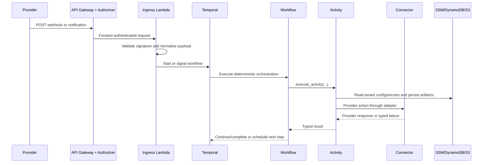

# Secamo Architecture Reference

## System Layers

Secamo follows a strict five-layer architecture that separates transport concerns, orchestration logic, side effects, and infrastructure dependencies.

- L1 (`API Gateway + Lambda Authorizer`) authenticates tenant context and enforces ingress gatekeeping.
- L2 (`Lambda Ingress Proxy`) validates provider payloads, normalizes request shapes, and starts or signals workflows.
- L3 (`Temporal Workflows`) contains deterministic orchestration logic and no direct I/O.
- L4 (`Activities + Connectors`) performs API/database/storage side effects and provider-specific adapter calls.
- L5 (`AWS services + Provider APIs`) hosts data stores/secrets and third-party security/ticketing endpoints.

Boundary rules:

- Workflows must not call AWS or provider APIs directly.
- Activities must be retry-safe and idempotent where possible.
- Tenant secrets are resolved from SSM path conventions, not hardcoded.

## Contract Ownership (Source of Truth)

Secamo enforces a single-source contract model split:

- `shared.models` owns domain contracts: workflow inputs/outputs, event payloads, and canonical business data models.
- `shared.providers` owns provider contracts: provider capability protocols, provider type enums, connector interface contracts, and provider-to-secret mapping.
- `connectors` owns concrete connector implementations only.

Rules:

- Do not define provider protocols in `shared.models`.
- Do not define domain/event payload models in `shared.providers`.
- Do not recreate a parallel `contracts/` package.

## Data Flow

The following sequence shows a representative flow from inbound event to orchestration and external side effects.

Operational flow characteristics:

- Ingress provides tenant-aware dispatch and callback signaling.
- Workflows coordinate branches and child workflows using durable Temporal history.
- Activities enforce side-effect boundaries and error translation for retries.

## Workflow Catalogue

| Workflow                           | File                                         | Trigger Source                                   | Core Actions                                                                                             | Queue          | Status |
| ---------------------------------- | -------------------------------------------- | ------------------------------------------------ | -------------------------------------------------------------------------------------------------------- | -------------- | ------ |
| `IamOnboardingWorkflow`            | `workflows/iam_onboarding.py`                | IAM ingress and lifecycle events                 | Create/update/delete/reset Graph users, optional licensing, audit logging, optional poller child startup | `iam-graph`    | Active |
| `DefenderAlertEnrichmentWorkflow`  | `workflows/defender_alert_enrichment.py`     | Routed intent for `defender.alert`               | Threat intel branch, enrichment child, optional ticket child, Teams notify, audit log                    | `soc-defender` | Active |
| `ImpossibleTravelWorkflow`         | `workflows/impossible_travel.py`             | Routed intent for `defender.impossible_travel`   | User/sign-in enrichment, ticketing, HiTL approval child, incident response child                         | `soc-defender` | Active |
| `GraphSubscriptionManagerWorkflow` | `workflows/graph_subscription_manager.py`    | Scheduled/manual Temporal start                  | Reconcile desired subscriptions, renew expiring entries, signal-driven control loop, continue-as-new     | `soc-defender` | Active |
| `PollingManagerWorkflow`           | `workflows/polling_manager.py`               | Started by onboarding flow for polling providers | Fetch provider events, route mapped intents, start downstream workflows, continue-as-new loop            | `poller`       | Active |
| `AlertEnrichmentWorkflow`          | `workflows/child/alert_enrichment.py`        | Child of defender enrichment                     | Device/user context enrichment and risk scoring                                                          | `soc-defender` | Active |
| `ThreatIntelEnrichmentWorkflow`    | `workflows/child/threat_intel_enrichment.py` | Child of defender and impossible-travel flows    | Threat intel fanout and result normalization                                                             | `soc-defender` | Active |
| `TicketCreationWorkflow`           | `workflows/child/ticket_creation.py`         | Child of SOC parent workflows                    | Provider-agnostic ticket creation                                                                        | `soc-defender` | Active |
| `HiTLApprovalWorkflow`             | `workflows/child/hitl_approval.py`           | Child of impossible-travel flow                  | Issue approval request, wait for signal, handle timeout policy                                           | `soc-defender` | Active |
| `IncidentResponseWorkflow`         | `workflows/child/incident_response.py`       | Child of impossible-travel flow                  | Execute decision actions and evidence/ticket follow-up                                                   | `soc-defender` | Active |
| `UserDeprovisioningWorkflow`       | `workflows/child/user_deprovisioning.py`     | Child path from onboarding delete actions        | Revoke sessions and delete user in Graph                                                                 | `iam-graph`    | Active |

## Connector Catalogue

| Connector Key        | File/Class                                                     | Type                              | Status |
| -------------------- | -------------------------------------------------------------- | --------------------------------- | ------ |
| `microsoft_defender` | `connectors/microsoft_defender.py` / `MicrosoftGraphConnector` | EDR and Graph security operations | Active |
| `jira`               | `connectors/jira.py` / `JiraConnector`                         | Ticketing                         | Active |
| `crowdstrike`        | `connectors/stub_providers.py` / `CrowdStrikeConnector`        | EDR                               | Stub   |
| `sentinelone`        | `connectors/stub_providers.py` / `SentinelOneConnector`        | EDR                               | Stub   |
| `halo_itsm`          | `connectors/stub_providers.py` / `HaloItsmConnector`           | Ticketing                         | Stub   |
| `servicenow`         | `connectors/stub_providers.py` / `ServiceNowConnector`         | Ticketing                         | Stub   |
| `virustotal`         | `connectors/stub_providers.py` / `VirusTotalConnector`         | Threat intel                      | Stub   |
| `abuseipdb`          | `connectors/stub_providers.py` / `AbuseIpdbConnector`          | Threat intel                      | Stub   |
| `misp`               | `connectors/stub_providers.py` / `MispConnector`               | Threat intel sharing              | Stub   |

## Multi-tenancy Model

Tenant isolation is explicit across ingress, orchestration, and side effects.

- Every primary workflow payload carries `tenant_id`.
- Tenant config and secrets are loaded per tenant via activities.
- Connector instances are created per tenant with tenant-scoped credentials.
- HiTL tokens and callback handling map decisions to tenant-scoped workflow identities.

Primary path conventions:

- Config: `/secamo/tenants/{tenant_id}/config/*`
- Secrets: `/secamo/tenants/{tenant_id}/{secret_type}/{key}`

This design supports mixed provider configurations per tenant without code branching in workflow definitions.

## Security Boundaries

Security controls are split by ingress stage and storage path:

- L1 authorizer enforces tenant header context and deny-by-default policy.
- L2 ingress validates provider authentication artifacts and request integrity prior to dispatch.
- Route mapping and dispatch are centralized (`shared/routing/defaults.py`) to avoid ad hoc workflow starts.
- Workflow code remains side-effect free, reducing replay and tampering risk surface.
- AWS service access is scoped to activity/runtime layers and IAM roles provisioned in Terraform.

Sensitive material handling:

- No tenant credentials are stored in workflow state by hardcoded values.
- SSM is the source of truth for tenant credentials and config values.
- DynamoDB/S3 persistence is performed only via activities under worker execution context.
