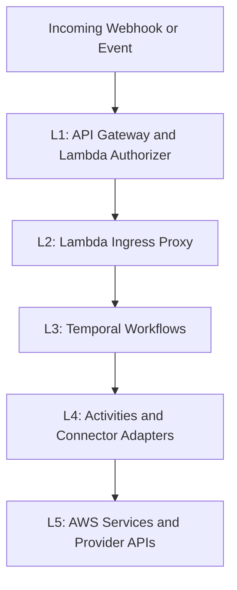

# Secamo Process Orchestrator

Multi-tenant security orchestration platform that ingests security and IAM events, runs deterministic Temporal workflows, and executes side effects through activity and connector layers.

## Overview

Secamo is a proof-of-concept MSSP-oriented backend for automating security operations across multiple tenants. It receives inbound events through AWS API Gateway and Lambda ingress, normalizes them into stable contracts, and dispatches long-running orchestration via Temporal. Workflow logic remains deterministic, while activities and connectors handle external side effects such as Graph, ticketing, notifications, and storage operations. The platform is designed around strict tenant isolation, queue-based workload partitioning, and replay-safe model contracts.

Primary stack: Python 3.11, Temporal Python SDK, AWS Lambda/API Gateway, boto3, and Pydantic v2.

## Architecture



### Contract Source of Truth

Secamo uses a strict split for typed boundaries:

- Domain models and event payload contracts live in `shared/models/*`.
- Provider contracts (provider protocols, provider type enums, and provider-to-secret mapping) live in `shared/providers/*`.
- Connector implementations in `connectors/*` must satisfy the connector interface contract defined in `shared/providers/protocols.py`.
- Legacy `contracts/` is removed and must not be reintroduced.

Practical rule:

- If the model describes workflow or event/business payload shape, place it in `shared.models`.
- If the model describes provider capability interface, provider identity typing, or secret mapping, place it in `shared.providers`.

## Quick Start

1. Create and activate a Python 3.11 virtual environment.
2. Install dependencies:
   ```bash
   pip install -r requirements.txt
   ```
3. Start local Temporal services:
   ```bash
   docker compose -f terraform/temporal-compose/docker-compose.yml up -d
   ```
4. Start workers:
   ```bash
   python -m workers.run_worker
   ```
5. Run tests:
   ```bash
   python -m pytest -q
   ```
6. Read module-specific runbooks for details:
   [activities/README.md](activities/README.md),
   [workflows/README.md](workflows/README.md),
   [connectors/README.md](connectors/README.md),
   [workers/README.md](workers/README.md),
   [shared/README.md](shared/README.md),
   [terraform/README.md](terraform/README.md),
   [tests/README.md](tests/README.md).

## Project Structure

| Folder             | Description                                                                | Documentation                                          |
| ------------------ | -------------------------------------------------------------------------- | ------------------------------------------------------ |
| `activities/`      | Temporal activity implementations for external side effects.               | [activities/README.md](activities/README.md)           |
| `connectors/`      | Provider adapter contracts and concrete/stub integrations.                 | [connectors/README.md](connectors/README.md)           |
| `shared/`          | Cross-cutting contracts, config, routing, auth, and helper layers.         | [shared/README.md](shared/README.md)                   |
| `terraform/`       | Infrastructure templates, environment definitions, and deployment scripts. | [terraform/README.md](terraform/README.md)             |
| `tests/`           | Unit and integration-safe test suites for contracts and runtime behavior.  | [tests/README.md](tests/README.md)                     |
| `workers/`         | Worker bootstrap and queue-scoped registration/runtime startup.            | [workers/README.md](workers/README.md)                 |
| `workflows/`       | Parent and child Temporal workflow orchestration logic.                    | [workflows/README.md](workflows/README.md)             |
| `workflows/child/` | Reusable child workflow stages composed by parent workflows.               | [workflows/child/README.md](workflows/child/README.md) |

## Configuration Reference

| Variable                     | Default                | Primary Usage                                                                                                                    |
| ---------------------------- | ---------------------- | -------------------------------------------------------------------------------------------------------------------------------- |
| `TEMPORAL_ADDRESS`           | `temporal:7233`        | Temporal frontend endpoint used by workers and ingress dispatch paths.                                                           |
| `TEMPORAL_NAMESPACE`         | `default`              | Temporal namespace for workflow execution.                                                                                       |
| `SECAMO_SENDER_EMAIL`        | `noreply@secamo.local` | Sender identity for email notification activity.                                                                                 |
| `EMAIL_PROVIDER`             | empty                  | Fallback connector for email actions when tenant provider is not email-capable (`ses`, `microsoft_defender`, `microsoft_graph`). |
| `EVIDENCE_BUCKET_NAME`       | empty                  | S3 bucket for evidence bundle writes.                                                                                            |
| `AUDIT_TABLE_NAME`           | empty                  | DynamoDB table for audit records.                                                                                                |
| `TENANT_TABLE_NAME`          | empty                  | Tenant table for active tenant lookup paths.                                                                                     |
| `GRAPH_SUBSCRIPTIONS_TABLE`  | empty                  | DynamoDB metadata for Graph subscriptions.                                                                                       |
| `HITL_TOKEN_TABLE`           | empty                  | DynamoDB table for HiTL callback tokens.                                                                                         |
| `HITL_TOKEN_TTL_SECONDS`     | `900`                  | TTL window for HiTL callback token validity.                                                                                     |
| `HITL_NAME_PREFIX`           | `secamo-temporal-test` | Prefix for generated HiTL response URLs and names.                                                                               |
| `GRAPH_NOTIFICATION_APP_IDS` | empty                  | Allowed app IDs for Graph notification token validation.                                                                         |
| `LOG_LEVEL`                  | `INFO`                 | Logging level used by ingress/authorizer runtime handlers.                                                                       |

## Contributing

### Add a new connector

1. Implement a connector class in `connectors/` that extends `BaseConnector`.
2. Register it in `connectors/registry.py`.
3. Route usage through capability activities under `activities/` (for example `activities/edr.py`, `activities/identity.py`, `activities/ticketing.py`, or `activities/provider_capabilities.py`).
4. Add tests under `tests/` for behavior and failure classification.
5. Update [connectors/README.md](connectors/README.md) and [ARCHITECTURE.md](ARCHITECTURE.md).

### Add a new workflow

1. Implement the workflow class in `workflows/` or `workflows/child/`.
2. Register it in `workers/run_worker.py` for the appropriate task queue.
3. Add or update route mapping in `shared/routing/defaults.py` and keep mapper/normalization helpers aligned where needed.
4. Add or update tests in `tests/`.
5. Update [workflows/README.md](workflows/README.md), [workflows/child/README.md](workflows/child/README.md), and [ARCHITECTURE.md](ARCHITECTURE.md).
