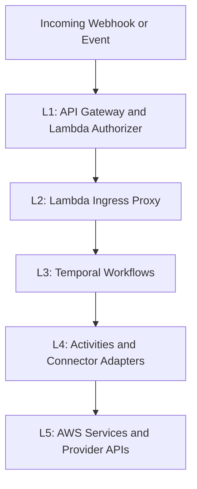

# Process Orchestrator (Built by Secamo)

Multi-tenant security and IAM orchestration backend with deterministic Temporal workflows, activity-based side effects, and provider connector adapters.

## Overview

This repository contains Secamo's Process Orchestrator: a proof-of-concept automation engine for MSSP-style security operations.

Important naming note:

- Secamo is the company building this platform.
- The tool in this repository is the Process Orchestrator.

The platform receives webhook and polling events, normalizes them into typed contracts, routes them to queue-scoped workflows, and executes side effects through activities/connectors. The architecture is deterministic at workflow level and tenant-scoped at runtime.

## Table of Contents

- [Features](#features)
- [Use Cases](#use-cases)
- [Capabilities](#capabilities)
- [Integrations](#integrations)
- [Workflow Catalog](#workflow-catalog)
- [Architecture](#architecture)
- [Quick Start](#quick-start)
- [Usage](#usage)
- [Configuration](#configuration)
- [Project Structure](#project-structure)
- [Contributing](#contributing)

## Features

- Deterministic Temporal workflows (no direct I/O in workflow code).
- Strict 5-layer architecture from ingress to side effects.
- Multi-tenant secret and config isolation via AWS SSM path conventions.
- Queue-scoped worker runtime (`user-lifecycle`, `edr`, `ticketing`, `interactions`, `audit`, `polling`).
- Rule-based and event-type route resolution with centralized registry defaults.
- Webhook and polling event ingestion patterns.
- Typed Pydantic boundaries for domain contracts (`shared/models`) and provider contracts (`shared/providers`).
- Human-in-the-loop (HiTL) approval callbacks with token lifecycle controls.
- Connector registry abstraction for provider integrations and stubs.

## Use Cases

- SOC alert triage for Defender and compatible EDR event streams.
- Sign-in anomaly handling from security signal flows.
- Risky user triage and remediation decision support.
- Device non-compliance remediation orchestration.
- Audit log anomaly triage.
- IAM onboarding and deprovisioning flows.
- Tenant onboarding stages (bootstrap, subscription reconcile, communications, evidence).
- Polling bootstrap and durable polling-manager loops for providers without webhook push.

## Capabilities

| Domain                       | Capability                                                                                 |
| ---------------------------- | ------------------------------------------------------------------------------------------ |
| Ingress and Routing          | Provider event/resource mapping, rule predicates, best-effort fan-out dispatch             |
| Workflow Orchestration       | Parent/child workflow composition, deterministic branching, queue affinity                 |
| Identity and Access          | User create/update/delete, password reset, revoke sessions, license assignment             |
| SOC and EDR                  | Alert enrichment, risk context, incident response orchestration, signal-specific workflows |
| Threat Intel                 | Reputation fanout (`virustotal`, `abuseipdb`) with normalized results                      |
| Ticketing and Communications | Ticket create/update/close plus email/notification activities                              |
| HiTL Controls                | Approval request issuance, callback token persistence, timeout and decision paths          |
| Evidence and Audit           | Evidence bundles and audit records via activity layer                                      |

## Integrations

### Active Connectors

| Provider Key         | Implementation                    |
| -------------------- | --------------------------------- |
| `microsoft_defender` | `MicrosoftGraphConnector`         |
| `microsoft_graph`    | `MicrosoftGraphConnector` (alias) |
| `jira`               | `JiraConnector`                   |
| `ses`                | `SesConnector`                    |
| `virustotal`         | `VirusTotalConnector`             |
| `abuseipdb`          | `AbuseIpdbConnector`              |

### Stub Connectors

| Provider Key  | Implementation         |
| ------------- | ---------------------- |
| `crowdstrike` | `CrowdStrikeConnector` |
| `sentinelone` | `SentinelOneConnector` |
| `halo_itsm`   | `HaloItsmConnector`    |
| `servicenow`  | `ServiceNowConnector`  |
| `misp`        | `MispConnector`        |

## Workflow Catalog

### Ingress-Routed Workflows

| Workflow                              | Route Source                                                                                               | Queue            |
| ------------------------------------- | ---------------------------------------------------------------------------------------------------------- | ---------------- |
| `SocAlertTriageWorkflow`              | `defender.alert`, `defender.impossible_travel`, `defender.security_signal` fallback, plus provider aliases | `edr`            |
| `SigninAnomalyDetectionWorkflow`      | Rule: `defender.security_signal` + `provider_event_type=signin_log`                                        | `edr`            |
| `RiskyUserTriageWorkflow`             | Rule: `defender.security_signal` + `provider_event_type=risky_user`                                        | `edr`            |
| `DeviceComplianceRemediationWorkflow` | Rule: `defender.security_signal` + `provider_event_type=noncompliant_device`                               | `edr`            |
| `AuditLogAnomalyWorkflow`             | Rule: `defender.security_signal` + `provider_event_type=audit_log`                                         | `edr`            |
| `IamOnboardingWorkflow`               | IAM onboarding events via provider/event mapping                                                           | `user-lifecycle` |

### Operational and Child Workflows

| Workflow                                       | Role                                                | Queue            |
| ---------------------------------------------- | --------------------------------------------------- | ---------------- |
| `CustomerOnboardingWorkflow`                   | Parent onboarding flow                              | `user-lifecycle` |
| `PollingBootstrapWorkflow`                     | Reconcile/start polling manager executions          | `polling`        |
| `PollingManagerWorkflow`                       | Poll provider resources and route downstream events | `polling`        |
| `ThreatIntelEnrichmentWorkflow`                | Child threat-intel fanout stage                     | `edr`            |
| `AlertEnrichmentWorkflow`                      | Child alert enrichment stage                        | `edr`            |
| `IncidentResponseWorkflow`                     | Child remediation/response stage                    | `edr`            |
| `TicketCreationWorkflow`                       | Child ticket stage                                  | `ticketing`      |
| `HiTLApprovalWorkflow`                         | Child approval stage                                | `interactions`   |
| `OnboardingBootstrapStageWorkflow`             | Child tenant bootstrap stage                        | `user-lifecycle` |
| `OnboardingSubscriptionReconcileStageWorkflow` | Child subscription reconcile stage                  | `edr`            |
| `OnboardingCommunicationsStageWorkflow`        | Child communications stage                          | `user-lifecycle` |
| `OnboardingComplianceEvidenceStageWorkflow`    | Child compliance evidence stage                     | `user-lifecycle` |
| `UserDeprovisioningWorkflow`                   | Child deprovisioning stage                          | `user-lifecycle` |

## Architecture



### Contract Ownership

- Domain/event contracts: `shared/models/*`
- Provider protocols/types/secret mapping: `shared/providers/*`
- Concrete provider adapters: `connectors/*`

### Tenant Secret Convention

Tenant credentials are loaded from AWS SSM using tenant-scoped paths:

`/secamo/tenants/{tenant_id}/{secret_type}/{key}`

## Quick Start

1. Create and activate a Python 3.11 virtual environment.
2. Install dependencies:

   ```bash
   pip install -r requirements.txt
   ```

3. Start local Temporal services:

   ```bash
   docker compose -f terraform/temporal-compose/docker-compose.yml up -d
   ```

4. Start workers:

   ```bash
   python -m workers.run_worker
   ```

5. Run tests:

   ```bash
   python -m pytest -q
   ```

## Usage

### Run the Worker Runtime

```bash
python -m workers.run_worker
```

This starts workers for all queue domains:

- `user-lifecycle`
- `edr`
- `ticketing`
- `interactions`
- `audit`
- `polling`

### Run Full Test Suite

```bash
python -m pytest -q
```

### Run Focused Routing/Dispatcher Tests

```bash
python -m pytest -q tests/test_case_intake_routing.py tests/test_dispatcher_signal_normalization.py tests/test_worker_signal_registration.py
```

### Module Runbooks

- [activities/README.md](activities/README.md)
- [workflows/README.md](workflows/README.md)
- [workflows/child/README.md](workflows/child/README.md)
- [connectors/README.md](connectors/README.md)
- [workers/README.md](workers/README.md)
- [shared/README.md](shared/README.md)
- [terraform/README.md](terraform/README.md)
- [tests/README.md](tests/README.md)

## Configuration

| Variable                      | Default                              | Usage                                                 |
| ----------------------------- | ------------------------------------ | ----------------------------------------------------- |
| `TEMPORAL_ADDRESS`            | `temporal:7233`                      | Temporal frontend endpoint                            |
| `TEMPORAL_NAMESPACE`          | `default`                            | Temporal namespace                                    |
| `SECAMO_SENDER_EMAIL`         | `noreply@secamo.local`               | Sender identity for outbound email                    |
| `EMAIL_PROVIDER`              | empty                                | Fallback connector key for email actions              |
| `EVIDENCE_BUCKET_NAME`        | empty                                | S3 bucket for evidence bundles                        |
| `AUDIT_TABLE_NAME`            | empty                                | DynamoDB table for audit records                      |
| `PROCESSED_EVENTS_TABLE_NAME` | empty                                | DynamoDB table for polling dedup state                |
| `PROCESSED_EVENTS_TTL_DAYS`   | `30` (guarded default)               | TTL in days for polling dedup event records           |
| `TENANT_TABLE_NAME`           | empty                                | DynamoDB tenant lookup table                          |
| `GRAPH_SUBSCRIPTIONS_TABLE`   | empty                                | DynamoDB Graph subscription metadata table            |
| `HITL_TOKEN_TABLE`            | empty                                | DynamoDB table for HiTL callback tokens               |
| `HITL_TOKEN_TTL_SECONDS`      | `900`                                | HiTL token TTL used by token store                    |
| `HITL_NAME_PREFIX`            | `secamo-temporal-test`               | Prefix for generated HiTL identifiers                 |
| `SECAMO_PUBLIC_BASE_URL`      | empty                                | Public base URL used for generated callback links     |
| `HITL_ENDPOINT_BASE_URL`      | empty                                | Explicit HiTL callback base URL override              |
| `GRAPH_NOTIFICATION_APP_IDS`  | empty                                | Allowed app IDs for Graph JWT notification validation |
| `AWS_REGION`                  | `eu-west-1` (SES connector fallback) | AWS region used by SES connector/runtime clients      |
| `LOG_LEVEL`                   | `INFO`                               | Authorizer logging level                              |

## Project Structure

| Folder             | Description                                                      | Documentation                                          |
| ------------------ | ---------------------------------------------------------------- | ------------------------------------------------------ |
| `activities/`      | Temporal activity implementations for side effects               | [activities/README.md](activities/README.md)           |
| `connectors/`      | Provider adapter implementations and registry                    | [connectors/README.md](connectors/README.md)           |
| `shared/`          | Cross-cutting contracts, routing, auth, and helpers              | [shared/README.md](shared/README.md)                   |
| `terraform/`       | Infrastructure modules and environment overlays                  | [terraform/README.md](terraform/README.md)             |
| `tests/`           | Unit/integration-safe tests for workflows, routing, and adapters | [tests/README.md](tests/README.md)                     |
| `workers/`         | Worker bootstrap and queue registration                          | [workers/README.md](workers/README.md)                 |
| `workflows/`       | Parent orchestration workflows                                   | [workflows/README.md](workflows/README.md)             |
| `workflows/child/` | Reusable child workflow stages                                   | [workflows/child/README.md](workflows/child/README.md) |

## Contributing

### Add a New Connector

1. Implement a connector class in `connectors/` extending `BaseConnector`.
2. Register provider key mapping in `connectors/registry.py`.
3. Route usage through activities (not directly from workflows).
4. Add tests under `tests/` for success/failure behavior.
5. Update connector and architecture documentation.

### Add a New Workflow

1. Implement workflow in `workflows/` or `workflows/child/`.
2. Register workflow in `workers/run_worker.py` on the correct task queue.
3. If ingress-triggered, update `shared/routing/defaults.py` and keep dispatcher normalization aligned.
4. Add routing/dispatcher/worker registration tests.
5. Update workflow and architecture documentation.
